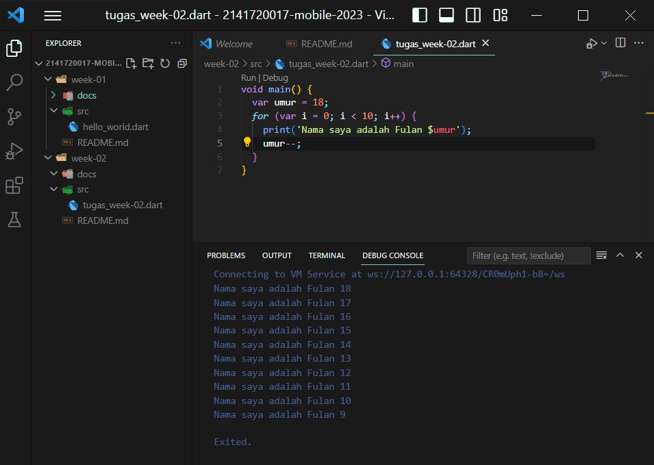

# Tugas pertemuan 2 Pemrograman Mobile - Fariabel dan tipe data #

Nama : Alvina Marcy Syakirah Permata

NIM : 2141720017

Kelas: TI-3F

Absen : 03

# Jawaban

Lampiran Gambar Soal 1

Soal 2

Penting untuk memahami bahasa pemrograman Dart sebelum menggunakan framework Flutter adalah karena Flutter menggunakan bahasa pemrograman Dart sehingga jika kita telah memahami Dart terlebih dahulu maka akan lebih mudah dalam mengkreasikan program dengan Flutter dan dapat menulis kode dengan lebih optimal. Selain itu kita juga akan lebih mudah ketika menghadabi bug dalam pengembanagn flutter

Soal 3

a. dart bertujuan menggabungkan kelebihan dari sebagian besar bahasa tinggak tinggi dr fitur program terkini antara lain 
- Productive tooling
- Garbage collection
- Type annotations (opsional)
- Statically typed
- Portability

b. Introducing the structure of the Dart language
- Arithmetic operators (+, -, /, ~/, %, -expression)
- Increment and decrement operators (--var, var--, ++var, var++)
- Equality and relational operators (== and !=). untuk melakuka penguian relasional (>, <, >=, <=)
- Logical operators (!expression, ||, &&)

c. Variable declaration
- strukturnya yitu -> tipedata namaVariabel = value;
- syaratnya :
    - nama variabel tidak boleh nama keyword seperti new atau class
    - Harus mengandung karakter alfabet dan angka
    - Tidak boleh dimulai dengan angka.

d. Null savety
- dart akan mencegah varibael bernilai null dan erornya di level compiler kecuali memang variabel tersebut di izinkan bernilai null 
- dart mendukungn variabel yang diizinkan bernilai null dengan menambah karakter '?' setelah tipe data untuk menetukan bahwa variabel tersebut bisa null contoh: 

    int? newNumber; // Tipe newNumber mengizinkan kemungkinan bernilai null

    print(newNumber); // Mencetak null 

- Untuk mengakses nullable variables diperlukan pengecekan apakah variabel masih bernilai null atau tidak

    int? goals;

    // Other code

    If (goals != null) {

    print(goals + 2);

    }  

e. Late variables
- untuk memberitahuakn kepada Dart bahwa sebuah variabel akan di berikan nilai setelah beberapa proses dilakukan tanpa perlu pengecekan  null sehingga program lebih mudah di baca

f. Built-in types
- pada Dart memiliki tipe data bawaan yitu num yang bisa menggantikan int, doduble atau apapun asalkan berupa angka sehingga dapat meminimalisir eror ketika nilai yang di dapat berupa bilangan bulat mauoun desimal.

g. Booleans (bool) yang mengmbalikan nilaii berupa true atau false

h. Angka 
- Dart merepresentasikan angka dengan bilangan bulat ataupun desimal. Selain itu, kita memiliki banyak fungsi berguna di perpustakaan dart:math untuk membantu perhitungan, seperti yang berikut:
    - Random untuk menghasilkan bool atau angka acak
    - Min atau Max untuk menemukan angka yang lebih besar atau lebih kecil dari dua angka
    - Fungsi Trigonometri (sinus, kosinus, tangen)

i. Array, List, maps
- Array : length tidak dapat bertambah secara otomatis
- List : length array dapat bertambah secara otomatis
- Maps :koleski dalam dart seperti array dan list namun cara menyimpannya menggunakan key-value pairs. di mana pengambilan dan modifikasi suatu nilai selalu dilakukan melalui kunci yang terkait. Baik kunci maupun nilai dapat memiliki jenis apa pun. Anda dapat melihat contoh: 

    Map nameAgeMap = {};
    
    nameAgeMap["Alice"] = 23;

    print(nameAgeMap["Alice"]); // Prints 23

j. Strings
- untuk mennggunakan string di Dart bisa menggunakan petik satu ('..') atau petik dua(".."). 
- Multiline String menggunkan petik satu sebnyak 3 ('''...''')

k. Const and Final 
- Const merupakan pengatuan suatu variabel tetap yang tidak boleh bernilai null dan tidak akan bisa diganti nilainya
- final merupakan pengaturan suatu variabel yang bisa bernilai null sementara namun setelah di definisikan nilainya maka setelahnya tidak akan dapat bisa di ubah.