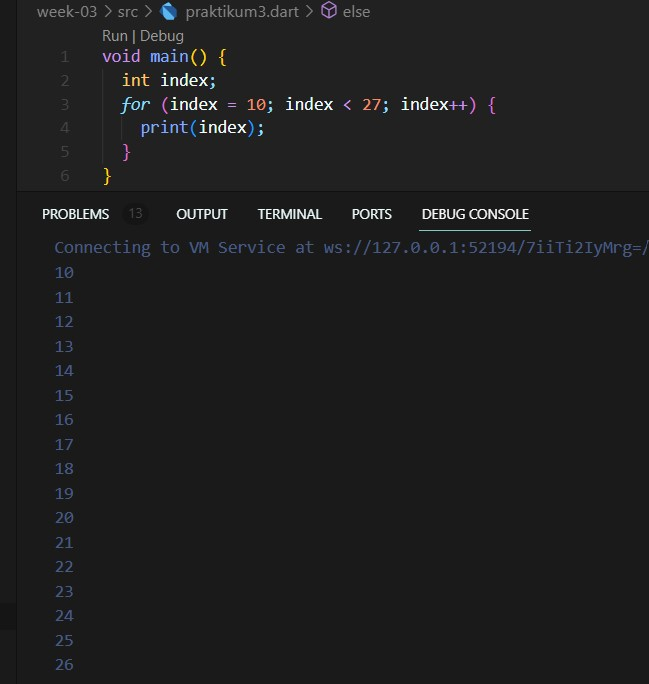

# Tugas pertemuan 3 Pemrograman Mobile - Controll flow dan perulangan #

Nama : Alvina Marcy Syakirah Permata

NIM : 2141720017

Kelas: TI-3F

Absen : 03

## Praktikum 1

### Langkah 1
Kode sesuai contoh praktikum

### Langkah 2 
kode setelah di perbaiki

Terjadi eror ketika di run karena pada if else ada penggunaan huruf besar yang tidak sesuai. sehingga perlu dilakukan perbaikan dengan mengganti huruf besar menjadi huruf kecil agar bisa likakukan run dan eror teratasi. 

sehingga menghasilkan print "Test2" dan "Test2 again" seperti pada contoh gambar di langkah 1

### Langkah 3

Kode sesuai contoh praktikum

kode setelah di perbaiki

pada awalnya terjadi eror dikarenakan tidak boleh ada nama variabel yang terduplikasi, selanjutnya pada persyaratan if harus bernilai bolean. namun pada case awal walaupun variabel test memiliki String dengan kata true namun itu bukanlah bolean namun masih sebuah string, sehingga perlu kita buat persyaratan menjadi if(test1 == "true") barulah nilai yang di hasilkan berupa bolean dan kode bisa di eksekusi tanpa eror.

## Praktikum 2

### Langkah 1
Kode sesuai contoh praktikum

### Langkah 2
terjadi eror dikarenakan variabel counter belum di buat dan belum di devinisikan nilainya.

kode setelah di perbaiki

ditambahkan variabel counter dengan tipe integer dan memiliki nilai 1. barulah looping while bisa berjalan

### Langkah 3
Kode sesuai contoh praktikum

kode yang di berikan pada contoh praktikum tidak terjadi eror sehingga perulangan di-while dapat berjalan dengan benar.

## Praktikum 3

### Langkah 1

terjadi eror karena variabel belum di buat dan looping akan terus berjalan karena variabel index tidak dilakukan increment sehingga looping akan terus berjalan ytanpa henti.

### Langkah 2

Setelah di perbaiki 

maka kita dapat membuat variabel index lalu membuat index dalam looping menjadi increment sehingga looping berjalan dengan baik

### Langkah 3

kode sesuai contoh

terdapat eror karena ketidak sesuaian huruf kapital yang di gunakan pada struktur if else serta nama variabel dalam if else tidak sesuai dengan nama variabel yang telah dibuat.

kode setelah di perbaiki

kita memperbaiki dengan mengubah struktur if else sesuai dengan ketentuan. lali sesuaikan nama variabel yang digunakna dengan nama variabel yang telah dibuat lalu letakkan eksekusi "print" sebelum "continue" agar print dapa tetap di lakukan sehingga tampil hasil yangb sesuai.

## Tugas - Membuat program untuk mengetahui bilangan prima

## Percobaan code switch case
