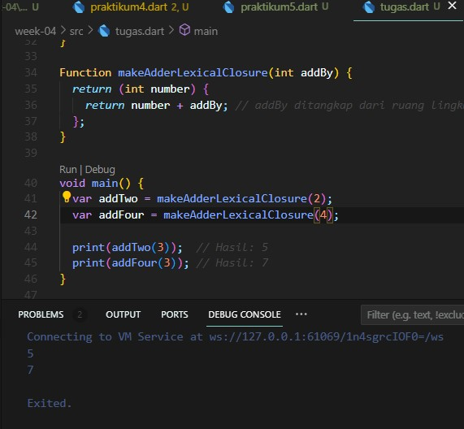

# Tugas pertemuan 4 Pemrograman Mobile - Collection, Records, and Function di Dart #

Nama : Alvina Marcy Syakirah Permata

NIM : 2141720017

Kelas: TI-3F

Absen : 03

## Praktikum 1

### Langkah 1

kode program sesuai contoh tidak terjadi eror

### Langkah 2 
variabel list dengan tipe data var dengan menggunakna kurung siku digunakan untuk membuat collection list. dilakukan assert (pengecekan eror jika nilai dalam assert false maka program selanjutnya tidak akan di jalankan) lalu setelah assert terpenuhi maka dilakukan print. selnajutnya pada "list[1] = 1;" dilakukan pengubahan isi list pada indeks ke satu.

### Langkah 3

kita ubah variabel list menjadi variabel final lalu isikan indeks ke 1 dan indeks ke 2 sebahai nama dan nim. jika variabel berupa variabel final maka jika isinya telah di identifikasikan maka tidak dapat di ganti setelahnya.

berikut contohnya

jika pada indeks 1 telah di isikan nama maka jika setelahnya ingin di ganti bahwa indeks 1 berisi 1 maka akan terjadi eror

## Praktikum 2

### Langkah 1

kode sesuai contoh

### Langkah 2

tidak terjadi eror. collection set menggunakan kurung kurawal. pada collection set jika ada isi data yang bernilai sama maka data awal akan tertimpa oleh data yang bernilai sama setelahnya sehingga nilainya hanya akan terbaca 1.

### langkah 3 

membuat variabel set pada variabel bernama names1 dan names2 dan untuk variabel bernama manes3 digunakan untuk membuat sebuah map kosong bukan sebuah set.

## Praktikum 3

### Langkah 1

### Langkah 2

pada langkah ini tidak terjadi eror. kode tersebut digunakan untuk membuat sebuah maps tanpa di identifikasikan tipe datanya.

### Langkah 3

menambahkan avariabel baru bernama mhs1 dengan tipe key,value -> <string,string> dan mhs2 dengan tipe key,value -> <int,string> 

lalu pada pengubahan isi maps pada variabel gifts dan nobleGases maka jika ada key yang sama dengan value yang berbeda maka key-value awal akan tertimpa oleh key-value yang akhir dan pengisian variabel mhs1 dan mhs2 tipedatanya harus sesuai dengan yang telah di identifikasikan.

## Praktikum 4
### Langkah 1

### Langkah 2 
terjadi eror dikarenakan terdapat perintah untuk mencetak variabel list1 namun variabel tersebut belum dibuat.

code setelah di benarkan

maka untuk mengatasi eror saya ubah perintah print(list1) menjadi perintah print(list).

kode program ini berfokus pada cara menggabungkan sebuah list pada list lain dengan menggunakna "..." (titik tiga)

### Langkah 3

terjadi eror karena kita membuat sebuah list baru tanpa memberikan tipe datanya.

kode setelah di perbaiki

setelah di perbaiki maka kita tambahkan tipe data pada variabel list1 yang di buat dan tambahkan variabel list berisi NIM dan gebungkan menggunakan Spread Operators (...)

### Langkah 4

terjadi eror karena didalam list nav terdapat logika if else dengan variabel promoActive sebagai persayratannya namun variabel promoActive tersebut belum di buat sehingga nilainya bukan true ataupun false.

kode yang sudah di benarkan

ketika promoActive bernilai false maka 'outlet tidak akan di tampilkan'.

ketika promoActive bernilai true maka 'outlet akan di tampilkan'.

### Langkah 5

eror terjadi karena variabel login pada syarat if else belum di buat 

kode setelah di benarkan jika variabel login memiliki kondisi false

kode setelah di benarkan jika variabel login memiliki kondisi true

### Langkah 6

tidak terjadi eror. kode ini dijalankan menggunakan Collection for. manfaatnya yaitu dapat mempersingkat kode untuk menggabungkan atau memodifikasi kolesi list pada dart. lalu kode ini menggunakan interpolasi string (dengan $), yang memungkinkan Anda untuk menyisipkan nilai variabel langsung ke dalam string

## Praktikum 5

### Langkah 1

### Langkah 2
terjadi eror dikarenakan setelah perintah print kurang ';' sehingga eror

kode setelah di perbaiki

### Langkah 3

Kode Program dapat berjalan dengan baik, dengan fungsi yang mereturn data yang sudah diswap atau tukar, yang sebelumnya (64, 32) menjadi (32, 64)

### Langkah 4

setelah kode di perbaiki

eror terjadi kerena record mahasiswa belum di inisialisasi sehingga perlu kita lakukan inisialisasi record tersebut.

### Langkah 5

tidak terjadi eror
kode program mengajarkan cara mencetak collectionrecord yang benar bahwa '$' menuju pada isi record yang bukan maps. namun untuk menampilkan maps kita hanya berlu menuliskan keynya saja maka value nya akan di cetak sedangkan urutan untuk isi recird yang bukan maps dihitung berurutan tanpa maps di ikut sertakan dalam urutan.

## Tugas Praktikum

#### 1. Silakan selesaikan Praktikum 1 sampai 5, lalu dokumentasikan berupa screenshot hasil pekerjaan Anda beserta penjelasannya!

praktikum 1-5 sudah di kerjakan di bagian atas laporan

#### 2. Jelaskan yang dimaksud Functions dalam bahasa Dart!

Functions dalam bahasa Dart merupakan collection yang digunakan untuk tujuan tertentu. fungsi memiliki nama, bisa menerima input (dalam bentuk parameter), dan dapat menghasilkan output dalam bentuk kembalian/return. Fungsi digunakan untuk mengelompokkan potongan kode yang melakukan tugas tertentu, memungkinkan kode untuk digunakan ulang, serta meningkatkan modularitas kan clean code (kode yang mudah di baca).

#### 3. Jelaskan jenis-jenis parameter di Functions beserta contoh sintaksnya!

- Positional parameters
    merupakan parameter paling dasar dimana urutan dalam penerusan argumen harus sesuai dengan urutan parameter saat mendefinisakn fungsi.
    

    ini untuk positional optional parameter
    

- Named parameters
    cara penggunaanya yaitu dengan menyebutkan nama variabel dari parameter saat memanggil fungsi tersebut.
    

- Default Parameter
    parameter ini memiliki nilai default atau nilai awal yang di definisikan pada function jika variabel parameter tersebut tidak diisi.
    

#### 4. Jelaskan maksud Functions sebagai first-class objects beserta contoh sintaknya!

fungsi sebagai first-class object yang berarti fungsi dapat diperlakukan seperti objek dari tipe data lainnya seperti
- Fungsi dapat disimpan dalam variabel
- Fungsi dapat diteruskan sebagai argumen ke fungsi lain.
- Fungsi dapat dikembalikan dari fungsi lain sebagai output.
- Fungsi dapat disimpan dalam struktur data seperti list, map, dll.

contoh sintaks 

#### 5. Apa itu Anonymous Functions? Jelaskan dan berikan contohnya!
Anonymous function adalah fungsi yang tidak memiliki nama. biasanya digunakna untuk operasi singkat yang mungkin hanya digunakan sekali.

ciri- cirinya yaitu :
- Tidak memiliki nama
- Bisa memiliki parameter ataupun tidak
- Didefinisikan langsung di tempat penggunaannya, biasanya sebagai argumen untuk fungsi lain.

contoh kode

#### 6. Jelaskan perbedaan Lexical scope dan Lexical closures! Berikan contohnya!

1. Lexical Scope (static scope) : merujuk bagaimana akses ke nama variabel diatur oleh lokasi dalam kode sumber dan berdasarkan pemblokiran kode  sumber di mana fungsi itu didefinisikan. Dengan kata lain, ruang lingkup suatu variabel ditentukan oleh struktur kode programnya, bukan dari mana fungsi tersebut dipanggil (berbeda dengan dynamic scope).

contoh lexical scope

2. Lexical closure (atau sering disebut hanya "closure") adalah fungsi yang “menangkap” variabel dari ruang lingkup di mana fungsi tersebut didefinisikan. Ini memungkinkan fungsi untuk mempertahankan akses ke variabel tersebut, bahkan jika fungsi tersebut dipanggil di luar ruang lingkup aslinya.

Contoh Lexical Closure:

#### 7. jelaskan dengan contoh cara membuat return multiple value di Functions!

- Mendefinisikan Fungsi dengan Tipe Pengembalian Map:
Pertama, Anda perlu mendefinisikan fungsi Anda dengan tipe pengembalian yang sesuai. Dalam kasus ini, kita akan menggunakan Map<String, dynamic> untuk memungkinkan pemberian label pada setiap nilai dengan tipe data yang beragam.

- Mengisi Map dengan Pasangan Key-Value:
Dalam tubuh fungsi, Anda akan mengisi Map dengan pasangan key-value yang merepresentasikan data yang ingin Anda kembalikan. Misalnya, Anda mungkin ingin mengembalikan nama, umur, dan pekerjaan seseorang:

- Menggunakan Fungsi dan Mengakses Nilainya:
Setelah Anda mendefinisikan fungsi, Anda dapat memanggilnya untuk mendapatkan detail seseorang dalam bentuk Map. Kemudian, Anda dapat mengakses nilai individu dengan menggunakan kunci yang sesuai:

contoh kode
