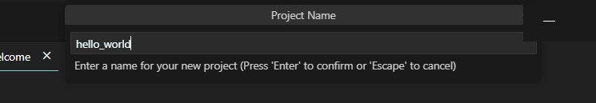
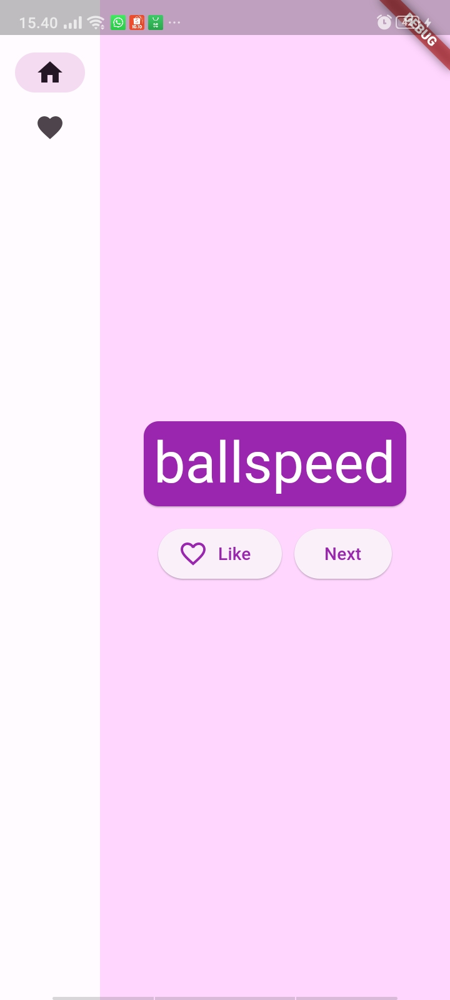
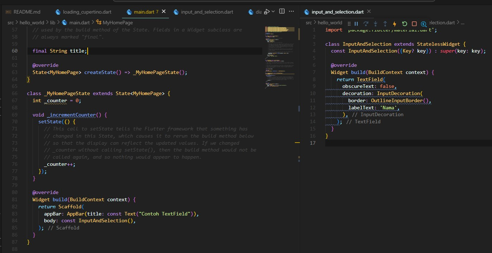

## Tugas pertemuan 5 Pemrograman Mobile - Flutter Fundamental 1 #

Nama : Alvina Marcy Syakirah Permata

NIM : 2141720017

Kelas: TI-3F

Absen : 03

## Praktikum 1
### Langkah 1

Membuat New Project Flutter tekan tombol Ctrl + Shift + P maka akan tampil Command Palette, lalu ketik Flutter. Pilih New Application Project.

### Langkah 2

Tentukan dimana folder ingin di letakkan

### Langkah 3

Buat nama project. Disini saya membuat nama project hello_world

### Langkah 4

Pesan akan tampil berupa "Your Flutter Project is ready!" artinya Anda telah berhasil membuat project Flutter baru.

## praktikum 3

### Langkah 1 : Text Widget

jangan lupa import file text_widget.dart di main. ganti bagian main di class _MyHomePageState

### Langkah 2 : Image Widget

ini menampilkan gambar. pada flutter jika ingin menampilkan gambar juga harus mengatur di file pubspec.yaml lalu sesuailan direktori dimana anda meletakkan gambar 

saat memanggilnya juga sesuaikan direktorinya

Tampilan pada andorid

## Praktikum 4
### langkah 1

membuat tampilan ketika program sedang di proses atau sedang loading
 

### langkah 2
 

### langkah 3

Tugas memisahkan scafflod dalam folder basic_widgets dan di panggil di main

Tampilan Mobile

### langkah 4

Tugas memisahkan dialog widget dalam folder basic_widgets dan di panggil di main

### langkah 5

Tugas memisahkan input dan selection widget dalam folder basic_widgets dan di panggil di main

### langkah 6

tugas memisahkan calender widget dalam folder basic_widgets dan di panggil di main

## Tugas First FLutter App

run app di android

