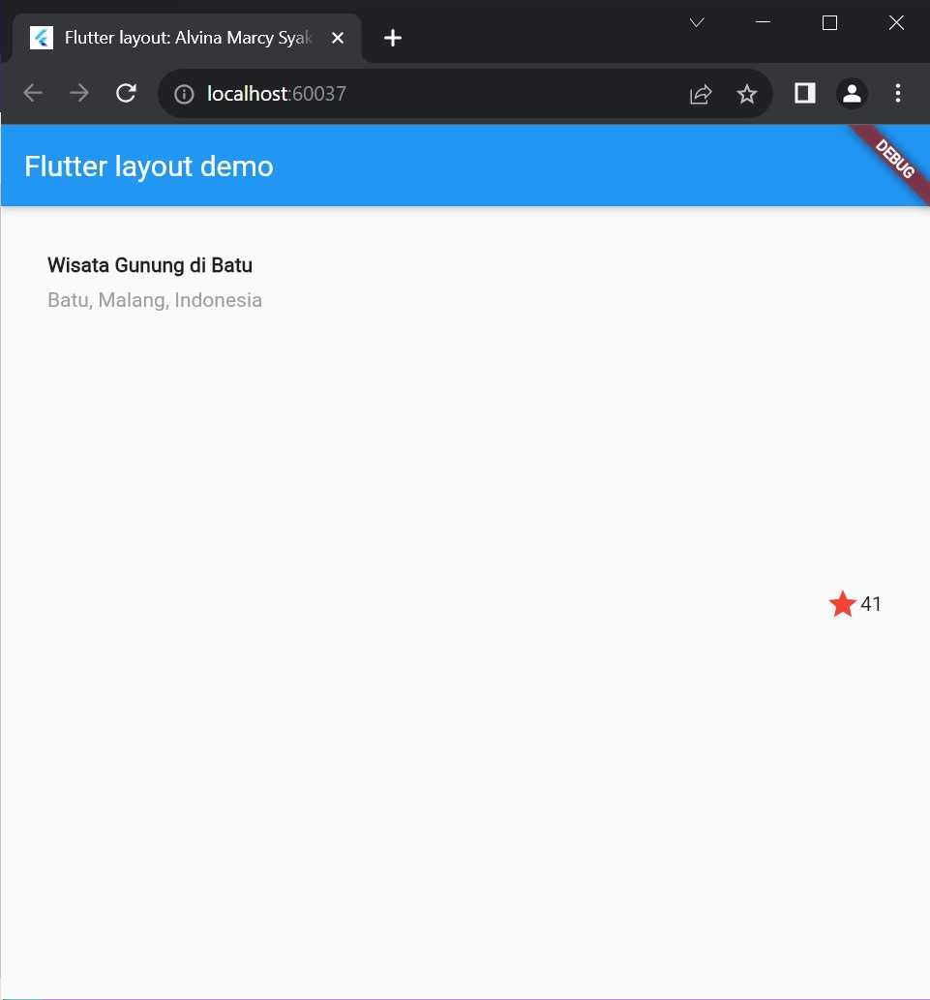

## Tugas pertemuan 7 Pemrograman Mobile - Layout-Navigasi #

Nama : Alvina Marcy Syakirah Permata

NIM : 2141720017

Kelas: TI-3F

Absen : 03

## Praktikum

### Praktikum 1

Praktikum 1 ini mengajari kita membuat layout sederhana. dengan begitu kita tahu saat ingin mengimplementasikan sebuah halaman, maka bagian mana yang pertama kali akan kita buat terlebih dahulu.

disini untuk permulaan kita membuat bagian baris pertama setelah gambar dimana pada baris tersebut berisi sebuah expanded, lalu di sebelahnya ada icon dan terakhir sebuah text

### Praktikum 2

Pada praktikum 2 ini membuat baris baru dimana pada baris itu berisi 3 kolom dan kolom ini dibuat sebuah class terpisah berupa kolom dimana kolom tersebut memiliki icon dan sebuah text.

### Praktikum 3

Pada paraktikum 3 ini dibuat sebuah widget baru yang berisi sebuah text kalimat yang berisi deskripsi dari borobudur.

### Praktikum 4

menampilkan perbedaan kode menggunakan 
body: Column() dan
body: ListView()

| Gambar | Kode |
| ----------- | :---------: |
|  | | 
| | |

dari tiap praktikum kita telah membuat class dan widget yang nantinya akan di panggil di return MaterialApp(). sehingga nantinya tiap widget yang telah kita buat akan bida di panggil untuk di tampilkan.

### tugas

| Percobaan 1 | Percobaan 2 | Penjelasan |
| ----------- | :---------: | ----------: |
|  || Row and Column : disini kita belajar bagaimana hasil letak elemen jika kita menggunakan row dan Column |
|  || max membuat lebar baris maksimal sesuai dengan layar atau lebar container yang membungkus row. min membuat lebar baris miminal atau hanya selebar isi dari baris tersebut |
|  ||mainAxisAlignment.start meletakkan elemen di awal baris. mainAxisAlignment.end meletakkan elemen di akhir baris (acuan horizontal untuk baris dan vertikal untuk colom) |
|  || crossAxisAlignment.center meletakkan elemen di tengah. crossAxisAlignment.start meletakkan elemen di bagian atas halaman (acuan vertikal untuk row, acuan horizontal untuk column ) |
|  || loose hanya akan memakan ruang yang diperlukan. tight akan memakan semua ruang yang tersedia untuknya setelah mempertimbangkan faktor fleksibilitas dari semua widget fleksibel lainnya di dalam layout yang sama. Ini berarti widget akan meregang sebanyak mungkin untuk memakan ruang yang tersedia.|
|  || angka pada flex mengatur seberapa besar persentase lebar sebuah elemen mendominasi lebar halaman|
|  || expanded menjadikan suatu elemen memiliki lebar yang memenuhirung kosong tersisa yang tidak digunakan oleh elemen lain |
|  || memberi contoh penggunaan width dan height untuk mengatur ukuran sebuah elemen |
|  || memberi contoh bagaimana memberikan space diantara 2 elemen yang lebar spacenya bisa kita atur statis sesuai keinginan menggunakan width |
|  || memberi contoh bagaimana memberikan space diantara 2 elemen menggunakan flex |
|  || membri contoh penggunaan CrossAlignment untuk text apakah di atas dan di tengah atau di bagian bawah halaman  |
|  || memberi contoh cara menampilkan icon dan mengatur warnanya |
|  || memberi contoh cara menampilkan gambar |

### Implementasi dari yang telah di pelajari pada tugas

Soal

jawaban

belajar mengimplementasikan Layout-navigasi