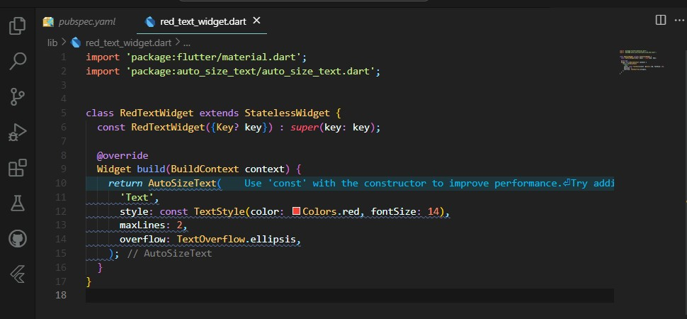

## Tugas pertemuan 8 Pemrograman Mobile - Manajemen Plugin #

Nama : Alvina Marcy Syakirah Permata

NIM : 2141720017

Kelas: TI-3F

Absen : 03

### Praktikum 

Eror di sebabkan karena plugin belum di import dan text tidak ada artinya. sehingga perbaikan eror dilakukan dengan meng impor plugin yang di gunakan dan membuat fariabel text agar tidak terjadi eror.

### Tugas Praktikum
#### 2. Jelaskan maksud dari langkah 2 pada praktikum tersebut!

'flutter pub add auto_size_text'

Kode tersbut digunakan untuk menambahkan sebuah package atau pustaka Flutter auto_size_text di projek yang sedang kita buat.

#### 3. Jelaskan maksud dari langkah 5 pada praktikum tersebut!

final String text; => ini dilakukan untuk membuat sebuah variabel bernama text dengan tipe String yang di identifikasi sebagai fariabel final (tidak akan bida di ubah jika sudah di inisialisasi).

sedangakan kode ini : const RedTextWidget({Key? key, required this.text}) : super(key: key); => merupakan deklarasi konstruktor untuk sebuah widget bernama RedTextWidget. 

required this.text => Ini adalah parameter yang diperlukan, yang berarti setiap kali Anda menginstansiasi RedTextWidget, Anda harus memberikan nilai untuk parameter ini. Parameter ini digunakan untuk menentukan teks (string) yang akan ditampilkan oleh widget.

#### Pada langkah 6 terdapat dua widget yang ditambahkan, jelaskan fungsi dan perbedaannya!

container pertama menggunakan widget custom dengan lebar 50 dan text style telah di atur dalam widget RedTextWidget sehingga menghasilkan warna text merah dan background kuning lalu maksimal baris dibuat 2 baris saja dan sisa text/overflownya menggunkana elipsis

container kedua menggunakna lebar 100 namun warna text menggunakan widget Text bawaan dari flutter dimana maksimal baris tidak di identifikasi sehingga tinggi kontainer akan menyesuaikan teks namun lebarnya akan tetap 100 piksel.

#### 5. Jelaskan maksud dari tiap parameter yang ada di dalam plugin auto_size_text berdasarkan tautan pada dokumentasi ini !

- MaxLines => digunakan untuk menampilkan hanya baris sawal sesuai yang di definisikan contoh jika maxLines: 3 maka hanya 3 baris pertama yang di tampilkan
- minFontSize & maxFontSize => digunakan untuk mengatur ukuran huruf terkecil dan terbesar ketika teks menyesuaikan ukuran dari kontainer akau pembungkusnya.
- group => ini akan membuat ukuran text akan sama jika berada dalam satu grup entah itu akan semakin kecil atau semakin besar tergantung ukuran dari anggota grupnya yang terkecil
- stepGranularity=> mengontrol seberapa besar perubahan langkah setiap berapa unit yang di tambahkan

    contoh 
    Slider(
    value: _sliderValue,
    onChanged: (newValue) {
        setState(() {
        _sliderValue = newValue;
        });
    },
    min: 0,
    max: 100,
    stepGranularity: 1, // Contoh: Perubahan nilai terjadi per 1 unit.
    )

- presetFontSizes => digunakan untuk mengatur ukuran text yang bisa di gunakan

    AutoSizeText(
    'A really long String',
    presetFontSizes: [40, 20, 14],
    maxLines: 4,
    )
    jadi ukuran teks hanya akan berubah jika menyentuh ukuran 40 atau 20 atau 14 sehingga ukuran teks tidak akan berukuran 30 (yang tidak ada dalam preset)

- overflowReplacement => jadi setelah teks terlalu panjang dan melebihi batas maksimal maka akan muncul pesan eror atau warning sesuai yang kita buat.

    contoh
    AutoSizeText(
    'A String tool long to display without extreme scaling or overflow.',
    maxLines: 1,
    overflowReplacement: Text('Sorry String too long'),
    )

- textAlign: menentukan penataan teks dalam widget, seperti kiri, tengah, atau kanan.

- textDirection: menentukan arah teks, seperti dari kiri ke kanan atau dari kanan ke kiri.

- locale: menentukan pengaturan regional untuk teks, seperti bahasa dan budaya.

- softWrap: Parameter softWrap menentukan apakah teks dapat pindah baris secara otomatis jika tidak cukup ruang.

- wrapWords: menentukan apakah teks harus memecah kata jika tidak cukup ruang.

overflow: Parameter overflow menentukan bagaimana teks akan dipotong jika melebihi batas ukuran yang ditentukan.

- textScaleFactor: mengontrol faktor skala teks, yang mempengaruhi ukuran font secara keseluruhan.

- semanticsLabel: memberikan label semantik yang digunakan untuk aksesibilitas, membantu pembaca layar dalam memahami konten teks.
