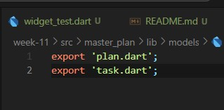
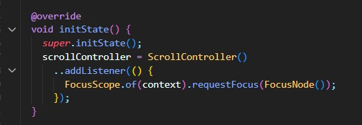
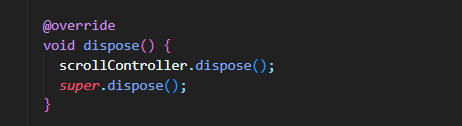

## Tugas pertemuan 11 Pemrograman Mobile - Dasar Manajemen State ##

Nama : Alvina Marcy Syakirah Permata

NIM : 2141720017

Kelas: TI-3F

Absen : 03

### Praktikum 1

#### Hasil Praktikum 1

Gif

#### Tugas Praktikum 1

##### 2. Jelaskan maksud dari langkah 4 pada praktikum tersebut! Mengapa dilakukan demikian?
 

**Pada praktikum 1 langkah ke 4**
kode export 'plan.dart'; dan export 'task.dart'; digunakan untuk membungkus model-model yang sudah dibuat yang nantinya akan digunakan di berbagai bagian dari aplikasi. dengan adanya file data_layer.dart dan mengekspor model-model tersebut, kita menciptakan satu tempat yang dapat diimpor oleh bagian-bagian lain dari aplikasi kita, sehingga proses impor menjadi lebih teratur dan mudah dikelola.

##### 3. Mengapa perlu variabel plan di langkah 6 pada praktikum tersebut? Mengapa dibuat konstanta ?

variabel plan digunakan untuk menyimpan objek dari kelas Plan yang berisi daftar tugas yang akan ditampilkan di layar. Variabel ini digunakan dalam metode _buildList() dan _buildAddTaskButton() untuk membangun daftar tugas dan menambahkan tugas baru ke dalam daftar.

Lalu variabel ini dibuat konstan ini merupakan cara untuk menginisialisasi variabel dengan nilai default.Pembuatan variabel plan sebagai konstanta (const Plan()) di dalam kelas _PlanScreenState mengindikasikan bahwa instance Plan yang dihasilkan adalah sebuah konstanta yang tidak dapat diubah setelah pembuatannya. Dengan kata lain, ini mengisyaratkan bahwa kita tidak akan mengganti plan yang ada di dalam _PlanScreenState. Jika rencananya didefinisikan sejak awal aplikasi dan tidak perlu diubah, maka membuatnya sebagai konstanta dapat membantu mencegah perubahan tidak disengaja di dalam kelas tersebut.

##### 4. Lakukan capture hasil dari Langkah 9 berupa GIF, kemudian jelaskan apa yang telah Anda buat!

gif

Pada praktikum 1 mulai dari langkah 1 hingga langkah 9 ini kita membuat sebuah aplikasi yang dapat membuat to-do list dengan struktur kode mencakup :

1. variabel plan untuk menyimpan objek berupa task yang harus di lakukan yang ditetapkan debagai konstanta pada awalnya
2. Appbar dengan judul 'Master Plan Namaku'
3. _buildAddTaskButton(): Metode ini digunakan untuk membuat tombol tambah tugas. Ketika tombol ditekan, kita memperbarui variabel plan dengan menambahkan tugas baru ke dalamnya.
4. _buildList(): Metode ini digunakan untuk membuat daftar tugas dengan menggunakan ListView.builder. Setiap item dalam daftar dirender menggunakan metode _buildTaskTile().
5. _buildTaskTile(): Metode ini mengembalikan widget ListTile yang berisi Checkbox untuk menandai keberhasilan suatu tugas dan TextFormField untuk mengedit deskripsi tugas. Saat terjadi perubahan pada Checkbox atau TextFormField, Anda memperbarui variabel plan sesuai dengan perubahan yang terjadi pada tugas tertentu.

jadi seluruh struktur ini memberikan pengguna kemampuan untuk melihat daftar tugas, menambahkan tugas baru, dan mengedit tugas yang aad melalui UI pengguna yang sederhana.

##### 5. Apa kegunaan method pada Langkah 11 dan 13 dalam lifecyle state ?

- Langkah 11: Tambah Scroll Listener
 Metode initState() dipanggil tepat setelah widget dimasukkan ke dalam pohon widget (widget tree) dan sebelum build() dipanggil pertama kali. Ini adalah tempat yang tepat untuk melakukan inisialisasi yang berkaitan dengan BuildContext. Dalam kode tersebut, initState() digunakan untuk membuat ScrollController dan menambahkan listener kepadanya. Listener ini akan memindahkan fokus ke FocusNode baru setiap kali pengguna melakukan scroll.
 

- Langkah 11: Tambah method dispose()
Metode dispose() dipanggil ketika widget ini dihapus dari pohon widget dan akan melepaskan semua sumber daya yang dimiliki oleh widget. Dalam kode Anda, dispose() digunakan untuk membuang ScrollController yang telah dibuat sebelumnya.

### Praktikum 2

#### Tugas Praktikum 2

##### 1. Selesaikan langkah-langkah praktikum tersebut, lalu dokumentasikan berupa GIF hasil akhir praktikum beserta penjelasannya di file README.md!

##### 2. Jelaskan mana yang dimaksud InheritedWidget pada langkah 1 tersebut! Mengapa yang digunakan InheritedNotifier?

Widget yang diwarisi (InheritedWidget) pada Langkah 1 mengembalikan notifikasi dari context.dependOnInheritedWidgetOfExactType()!.notifier!. Penggunaan InheritedNotifier penting karena memfasilitasi pengiriman notifikasi ketika ada perubahan pada data yang diamati (notifier). Pada konteks ini, PlanProvider menggunakan ValueNotifier untuk mengelola perubahan pada data Plan. Oleh karena itu, ketika ada perubahan pada data Plan, PlanProvider akan memberi tahu widget-widget di bawahnya yang menggunakan data tersebut untuk melakukan pembaruan (rebuild).

##### 3. Jelaskan maksud dari method di langkah 3 pada praktikum tersebut! Mengapa dilakukan demikian?

Fungsi completedCount: Metode ini menghitung jumlah tugas yang telah selesai dalam rencana (plan) dengan menggunakan metode where pada daftar tugas dan menghitung berapa banyak tugas yang memiliki atribut complete dengan nilai true.

Fungsi completenessMessage: Metode ini menghasilkan pesan yang menyatakan seberapa banyak tugas yang telah diselesaikan dari total tugas dalam rencana (plan). Pesan ini mengambil informasi dari metode sebelumnya (completedCount) dan menyajikan pesan dengan format yang menyatakan jumlah tugas yang sudah selesai dari total tugas.

Penambahan kedua metode ini memiliki tujuan untuk menyediakan informasi tambahan terkait rencana yang sedang ditampilkan, seperti memberikan informasi seberapa banyak tugas yang telah diselesaikan.

##### 4. Lakukan capture hasil dari Langkah 9 berupa GIF, kemudian jelaskan apa yang telah Anda buat!

Widget SafeArea ditempatkan untuk menempatkan teks plan.completenessMessage di bagian bawah layar, di luar daftar tugas. Hal ini dilakukan untuk memastikan bahwa teks tersebut tidak terhalang oleh elemen UI lainnya, seperti tombol navigasi sistem atau area status di perangkat. Anda dapat melihat hasil dari penempatan ini pada gambar bergerak yang terdapat pada nomor 1.

### Praktikum 3

#### Tugas Praktikum 3

##### 1. Selesaikan langkah-langkah praktikum tersebut, lalu dokumentasikan berupa GIF hasil akhir praktikum beserta penjelasannya di file README.md!

##### 2. Berdasarkan Praktikum 3 yang telah Anda lakukan, jelaskan maksud dari gambar diagram berikut ini!

Dari gambar diagram berdasarkan praktikum 3  terdapat 2 sturktur utama yang pertama yaitu merupakanyaitu halaman PlanCreatorScreen, struktur untuk membuat sebuah rencana yang dimana kita dapat memiliki lebih dari 1 rencana yang nantinya rencana tersebut akan di susun dalam list. Setelah itu, pengguna dapat mengklik rencana perjalanan tersebut untuk berpindah ke halaman PlanScreen.di halaman PlanScreen ini pengguna dapat memasukkan detail pekerjaan, seperti todolist. Setelah pengguna memasukkan semua detail pekerjaan, data rencana perjalanan akan disimpan ke dalam komponen PlanProvider.

##### 3. Lakukan capture hasil dari Langkah 14 berupa GIF, kemudian jelaskan apa yang telah Anda buat!

Dalam Langkah 14, fungsionalitas baru ditambahkan ke dalam PlanCreatorScreen, memungkinkan pengguna untuk membuat dan menampilkan daftar rencana (plans) baru. Langkah ini juga membantu mengimplementasikan dua layar yang terhubung secara berkesinambungan. Layar pertama, PlanCreatorScreen, memberikan pengguna kemampuan untuk membuat rencana baru, sementara layar kedua, PlanScreen, memungkinkan pengguna untuk melihat rincian dari rencana yang telah dibuat, serta melakukan penambahan, penghapusan, atau pengeditan tugas di dalamnya. Semua proses ini terintegrasi dengan lancar menggunakan PlanProvider untuk mengelola data secara efisien dan terstruktur.