## Tugas pertemuan 12 Pemrograman Mobile - Pemrograman Asynchronous ##

Nama : Alvina Marcy Syakirah Permata

NIM : 2141720017

Kelas: TI-3F

Absen : 03

### Soal 1

- Tambahkan nama panggilan Anda pada title app sebagai identitas hasil pekerjaan Anda.
- Gantilah warna tema aplikasi sesuai kesukaan Anda.
- Lakukan commit hasil jawaban Soal 1 dengan pesan "W13: Jawaban Soal 1"

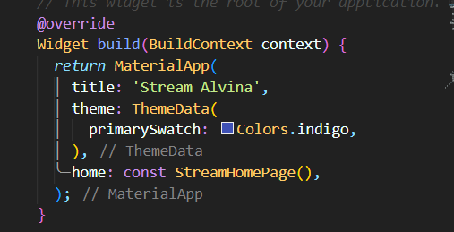

### Soal 2

- Tambahkan 5 warna lainnya sesuai keinginan Anda pada variabel colors tersebut.
- Lakukan commit hasil jawaban Soal 2 dengan pesan "W13: Jawaban Soal 2"

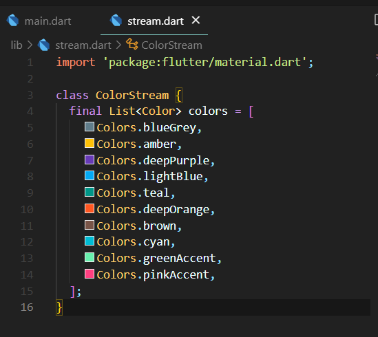

### Soal 3

- Jelaskan fungsi keyword yield* pada kode tersebut!

    keyword yield* digunakan untuk mengembalikan banyak nilai dari suatu stream
    
- Apa maksud isi perintah kode tersebut?

    dari kode tersebut 'Stream.periodic' menghasilkan stream dengan nilai yang berulang setiap periode waktu tertentu. dalam kode ini, setiap detik, 'yield*' akan digunakan untuk menghasilkan nilai dari stream yang disusun dari daftar warna yang ada di 'colors' yang sudah di buat. dan serangkasian warna tersebut akan berubah setiap detik berdasarkan nilai-nilai dari stream yang diberikan oleh Stream.periodic.

### Soal 4

### Soal 5

- Jelaskan perbedaan menggunakan listen dan await for (langkah 9) !

    pada awaitfor cara kerja dengan melakukan perulangan untuk mendapatkan data secara berurutan untuk mengambil data dari stream dengan memanggil method getColors(), lalu setiap value akan disimpan di variabel eventColor di setiap perulangannya. 
    namun blok kode dalam for seperti setState akan dijalankan setelah proses pemanggilan method getColors() selesai dilakukan dan sudah mengembalikan nilai set yang setiap valuenya akan disimpan dalam eventColor.
    sedangkan pada listen() setiap event atau value yang sudah diterima dapat langsung digunakan dan setState dapat dijalankan tanpa perlu menunggu seluruh Stream selesai.

## Praktikum 2
### Soal 6
Jelaskan maksud kode langkah 8 dan 10 tersebut!

- kode langkah 8

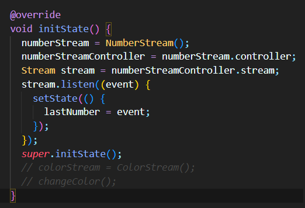

    Dalam langkah kedelapan, objek NumberStream dari file stream.dart dibuat terlebih dahulu. Setelah itu, variabel numberStreamController diakses dengan menyimpan controller dari numberStream ke dalamnya. Data stream dari numberStreamController kemudian akan disimpan dalam variabel stream yang memiliki tipe data Stream. Akhirnya, nilai dari stream ini akan digunakan untuk memperbarui nilai dari lastNumber.

- kode langkah 10

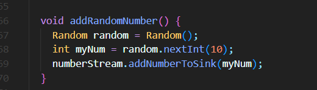

    Kode ini merupakan metode yang disebut addRandomNumber. Fungsinya adalah untuk menambahkan angka acak ke dalam stream yang dikendalikan oleh objek numberStreamController.
    Metode addRandomNumber() pertama-tama menciptakan objek Random() dengan nama random. Objek ini kemudian digunakan untuk menghasilkan nilai integer acak dalam rentang 0 hingga 9, yang disimpan dalam variabel myNum. Selanjutnya, metode addNumberToSink() dari objek numberStream, yang telah dibuat pada langkah kedelapan sebelumnya, dipanggil. Dengan mengakses addNumberToSink() dan memberikan nilai myNum sebagai argumen, nilai ini akan ditambahkan ke dalam aliran data yang telah dibuat.

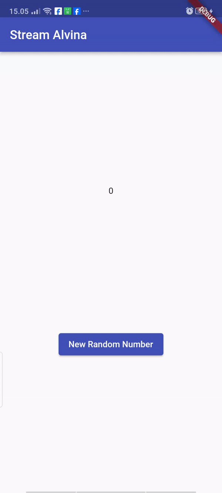

### Soal 7

- Jelaskan maksud kode langkah 13 sampai 15 tersebut!
    - kode langkah 13
    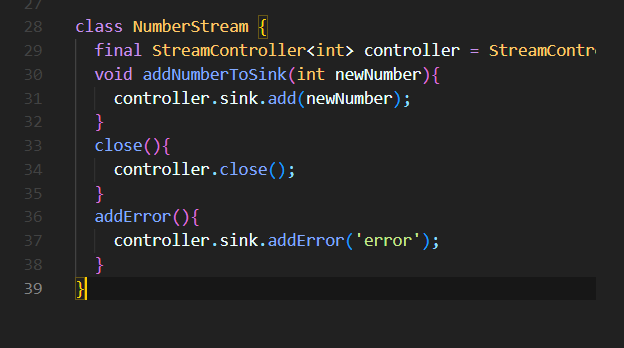
        - Metode addError() dalam kelas NumberStream digunakan untuk menambahkan kesalahan ke Stream. Kesalahan ini akan diterima oleh pendengar Stream menggunakan metode onError.Stream akan mencetak kesalahan 'Error: Null number received' dan menambahkan kesalahan 'Null number received' ke Stream.

    - kode langkah 14
    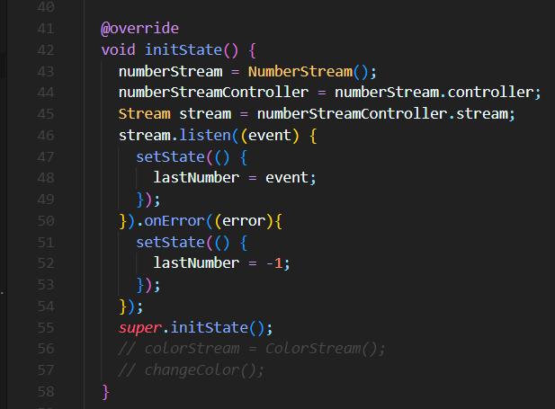
        - Kode digunakan untuk menangani kesalahan yang terjadi pada Stream. Jika kesalahan terjadi, kode ini akan memperbarui state lastNumber menjadi -1 untuk menunjukkan bahwa kesalahan telah terjadi. kesalahan dapat terjadi jika metode addRandomNumber() memanggil metode addError() pada NumberStream. Metode addError() digunakan untuk menambahkan kesalahan buatan ke Stream.

    - kode langkah 15
    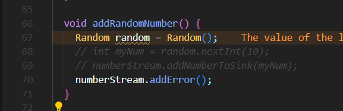
        - Metode numberStream.addError() digunakan untuk menambahkan kesalahan ke Stream.sehingga hal ini digunakan untuk sengaja membuat kesalahan 
        
## Praktikum 3
### Soal 8
- Jelaskan maksud kode langkah 1-3 tersebut!
    - langkah 1 : membuat objek StreamTransformer dengan nama transformer. nantinya digunakan untuk memanipulasi atau memfilter data pada Streams.
    - langkah 2 : Kode di atas berfungsi untuk mengelola aliran data dengan menggunakan objek StreamTransformer. Objek ini menerima aliran data yang berisi bilangan bulat dan menghasilkan aliran data dengan nilai juga dalam bentuk bilangan bulat. Pada parameter pertama, apabila aliran data tidak mengalami error, nilai dari aliran tersebut akan diperbarui dengan cara dikalikan dengan 10 dan hasilnya ditambahkan kembali ke dalam aliran data. Selanjutnya, pada parameter kedua, jika terjadi error pada aliran data, nilai dalam aliran tersebut akan diperbarui menjadi -1. Setelah proses selesai, filter ini akan ditutup
    - langkah 3 : Objek transformer yang telah dibuat sebelumnya akan digunakan dalam blok kode ini. Prosesnya akan mengubah data berdasarkan parameter yang telah ditentukan sebelumnya. Jika proses berlangsung tanpa adanya error, nilai yang sebelumnya telah ditambahkan oleh transformer akan digunakan untuk memperbarui nilai dari variabel lastNumber. Sebaliknya, jika terjadi error selama proses, nilai variabel lastNumber akan diatur kembali menjadi -1.
- Capture hasil praktikum Anda berupa GIF dan lampirkan di README.
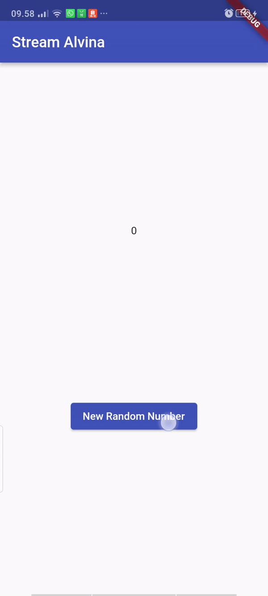

## Praktikum 4
### Soal 9
- Jelaskan maksud kode langkah 2, 6 dan 8 tersebut!

    penjelasan kode langkah 2

    Secara keseluruhan, bagian kode initState() memiliki tanggung jawab untuk melakukan inisialisasi terhadap aliran data (stream), membuat langganan (subscription) terhadap aliran tersebut, dan memperbarui nilai yang ditampilkan di antarmuka pengguna (UI) (lastNumber) setiap kali terjadi peristiwa baru yang dikirim melalui aliran data.

    Bagian yang baru dimodifikasi bertujuan untuk memantau perubahan yang terjadi pada suatu stream data.

    Dalam bagian tersebut, terdapat inisialisasi subscription yang dibuat dari stream.listen. Ini menciptakan langganan ke stream yang telah didefinisikan sebelumnya (Stream stream = numberStreamController.stream;). Ketika ada peristiwa baru yang diterima di dalam stream, fungsi yang diberikan pada listen akan dijalankan.

    Penjelasan untuk langkah 6:

    subscription.cancel() merupakan perintah yang menghentikan langganan atau subscription terhadap suatu Stream. Metode cancel() digunakan untuk mengakhiri langganan yang telah dibuat terhadap suatu Stream.

    Pemanggilan subscription.cancel() digunakan untuk memastikan bahwa langganan terhadap Stream yang terjadi pada initState() sudah dihentikan atau dibersihkan ketika stateful widget tidak lagi digunakan atau dihapus dari tree widget.

    Penjelasan untuk langkah 8:

    Fungsi addRandomNumber() bertugas untuk menambahkan bilangan acak ke dalam stream jika stream controller masih aktif. Jika tidak aktif, variabel lastNumber diatur menjadi -1 untuk menandakan adanya kesalahan karena stream controller telah ditutup.

    Ada operasi kondisional. Jika stream controller (numberStreamController) belum ditutup (artinya masih aktif), maka:

    numberStream.addNumberToSink(myNum);: Fungsi addNumberToSink() dipanggil pada objek numberStream untuk menambahkan bilangan yang telah dihasilkan (myNum) ke dalam sink (saluran) stream. Jika stream controller sudah ditutup, kondisi else akan dieksekusi:

    setState(() { lastNumber = -1; });: Mengeset nilai variabel lastNumber menjadi -1. Hal ini dikarenakan stream controller telah ditutup, sehingga tidak dapat menambahkan bilangan baru ke dalam stream.

- Capture hasil praktikum Anda berupa GIF dan lampirkan di README

pesan debug Console

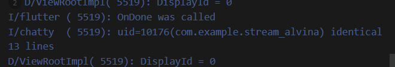
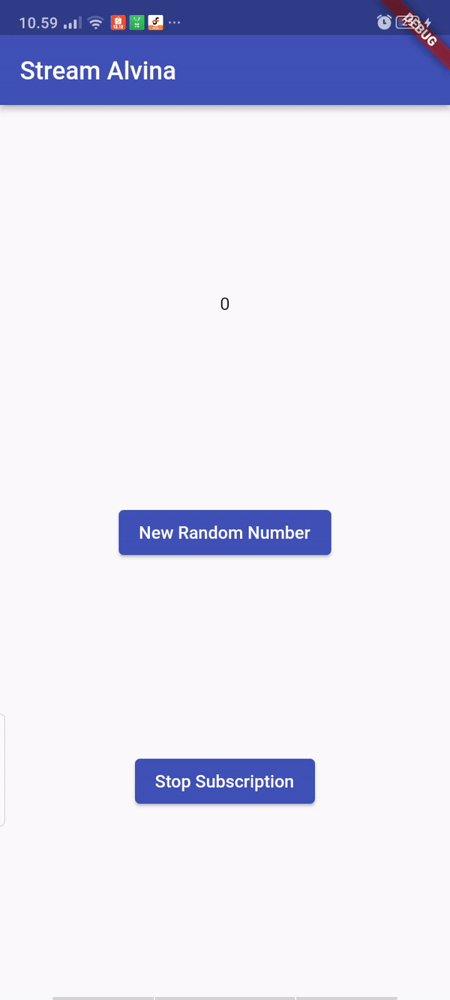

## Praktikum 5
### Soal 10
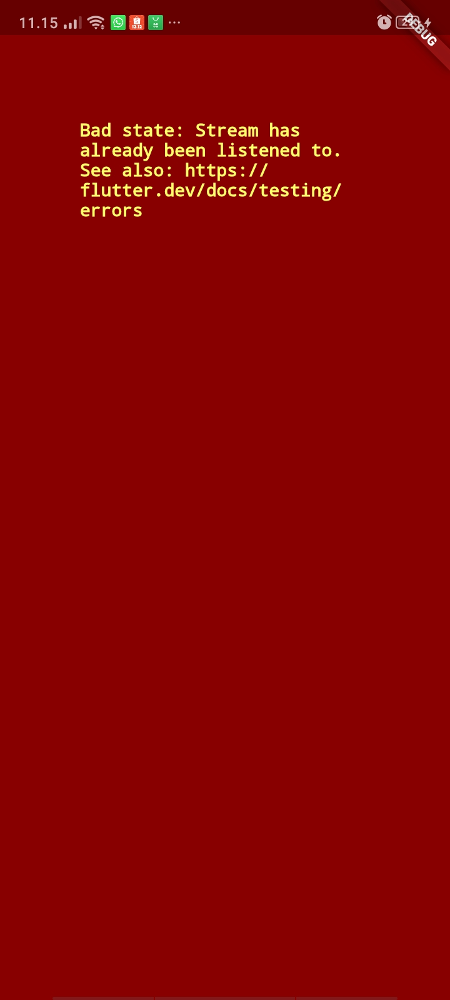

Kesalahan "bad state: Stream has already been listened to" muncul karena pada saat menginisialisasi subscription dan subscription2, keduanya mencoba mendengarkan stream yang identik, yaitu stream yang berasal dari numberStreamController.stream. Hal ini menimbulkan konflik karena sebuah stream hanya dapat didengarkan oleh satu subscription pada satu waktu. Kesalahan terjadi karena mencoba membuat subscription2 dengan stream yang sama tanpa menutup subscription terlebih dahulu. Kondisi ini menyebabkan error karena stream sudah memiliki subscription yang masih aktif dari sebelumnya.

### Soal 11

Jelaskan mengapa hal itu bisa terjadi ?

hal tersebut terjadi karena kita memiliki dua buah subscription yang menjalankan stream.listen()

Kedua subscription tersebut berperan dalam menambahkan nilai angka ke dalam string values setiap kali terjadi peristiwa dari stream. Saat tombol 'New Random Number' ditekan dan fungsi addRandomNumber() dipanggil, nilai acak baru ditambahkan ke numberStream. Hal ini mengakibatkan kedua langganan tersebut menerima event dari stream dan keduanya akan memperbarui nilai values. Sebagai hasilnya, setiap kali tombol 'New Random Number' ditekan, setiap langganan akan menambahkan nilai angka ke dalam values, menyebabkan nilai tersebut menjadi dua kali lipat dari seharusnya.